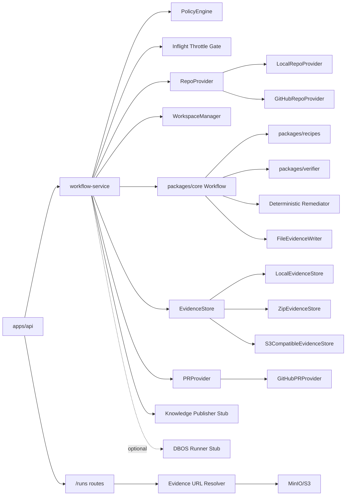
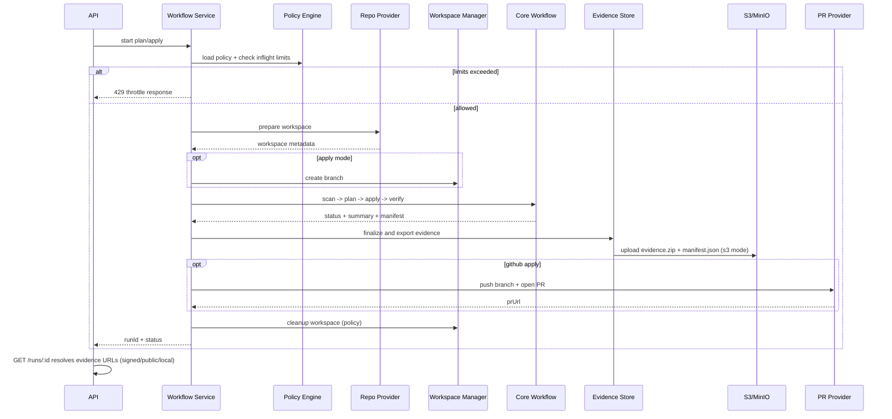

# Code Porter Architecture

## Module Diagram


## V1 Beta Runtime Flow


## Responsibilities
- `apps/api`
- HTTP routes, request validation, throttling response mapping, run/evidence URL responses.
- `apps/api/workflow-service`
- campaign run orchestration, DB persistence, policy throttling gates, provider wiring.
- `packages/workspace`
- isolated workspace lifecycle, local/github repo providers, branch preparation, cleanup.
- `packages/core`
- deterministic workflow stage sequencing, policy decisions, confidence scoring, run summaries.
- `packages/recipes`
- deterministic codemod recipes and engine ordering.
- `packages/verifier`
- build/test/static verification, failure classification, maven retry hardening.
- `packages/evidence`
- evidence write/finalize, zip export, S3-compatible upload, manifest export metadata.
- `packages/knowledge`
- optional run-summary publication stub.
- `packages/workflow-runner-dbos`
- durable execution adapter stub.

## Key Interfaces

### RecipeEngine
```ts
interface RecipeEngine {
  listRecipeIds(): string[];
  plan(scan: ScanResult, files: FileMap): RecipePlanResult;
  apply(scan: ScanResult, files: FileMap): RecipeApplyResult;
}
```

### Verifier
```ts
interface Verifier {
  run(scan: ScanResult, repoPath: string, policy: PolicyConfig): Promise<VerifySummary>;
}
```

### PolicyEngine
```ts
interface PolicyEngine {
  load(path: string): Promise<PolicyConfig>;
  evaluatePlan(input: PlanMetrics, policy: PolicyConfig): PolicyDecision[];
  evaluateVerify(input: VerifySummary, policy: PolicyConfig): PolicyDecision[];
}
```

### WorkspaceManager
```ts
interface WorkspaceManager {
  createWorkspace(runId: string): Promise<string>;
  ensureCleanTree(repoPath: string): Promise<void>;
  checkoutBase(repoPath: string, ref: string): Promise<{ ref: string; commit: string }>;
  createBranch(repoPath: string, campaignId: string, runId: string): Promise<string>;
  cleanupWorkspace(input: WorkspaceCleanupRequest): Promise<void>;
}
```

### RepoProvider
```ts
interface RepoProvider {
  prepareWorkspace(input: RepoPrepareInput): Promise<PreparedWorkspace>;
}
```

### EvidenceStore
```ts
interface EvidenceStore {
  finalizeAndExport(runCtx: RunContext): Promise<{
    manifest: EvidenceManifest;
    exports: EvidenceExportArtifact[];
  }>;
}
```

### PRProvider
```ts
interface PRProvider {
  createPullRequest(input: PullRequestInput): Promise<{ prUrl: string }>;
}
```

## Extension Points

### Legacy Lanes (COBOL, Fortran, PL/SQL)
- Add lane-specific scanners/IR translators behind shared workflow stage interfaces.
- Reuse policy, verifier gates, and evidence contract for parity and auditability.

### Agent Runners
- Current constrained remediator only performs deterministic infrastructure remediation.
- Future agent runner can be inserted after deterministic remediation with policy-allowed action sets.
- Free-form edits remain out of scope unless explicitly enabled with stricter policy/evidence controls.
