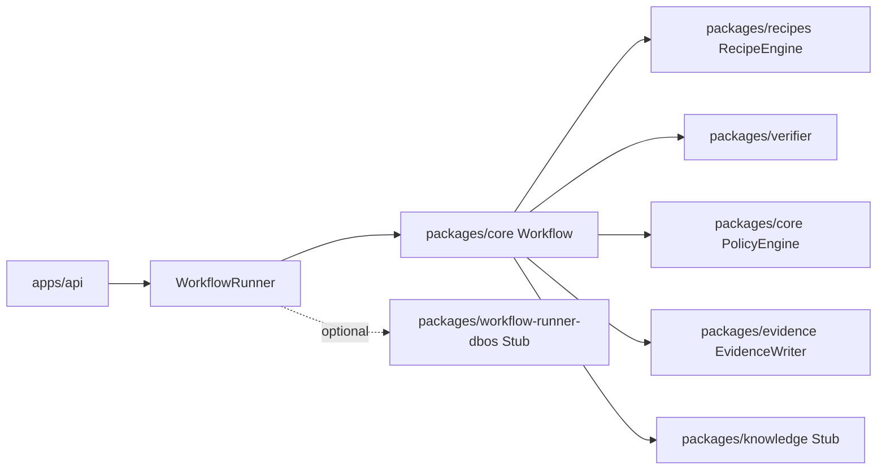

# Code Porter Architecture

## Module Diagram


## Responsibilities
- `apps/api`: REST endpoints, request validation, DB persistence orchestration.
- `packages/core`: workflow contracts, stage sequencing, policy checks, score computation.
- `packages/recipes`: deterministic transformations and planning.
- `packages/verifier`: tool detection and command execution for build/test/static checks.
- `packages/evidence`: artifact writer, checksums, manifest.
- `packages/workflow-runner-inmemory`: default immediate execution runner.
- `packages/workflow-runner-dbos`: durable orchestration adapter stub.
- `packages/knowledge`: future docs/context publication hook.

## Key Interfaces

### RecipeEngine
```ts
interface RecipeEngine {
  list(): Recipe[];
  plan(scan: ScanResult, files: FileMap): RecipePlanResult;
  apply(scan: ScanResult, files: FileMap): RecipeApplyResult;
}
```

### Runner
```ts
interface WorkflowRunner {
  start(runRequest: RunRequest): Promise<{ runId: string }>;
  get(runId: string): Promise<Run>;
}
```

### Verifier
```ts
interface Verifier {
  run(scan: ScanResult, repoPath: string, policy: PolicyConfig): Promise<VerifySummary>;
}
```

### EvidenceWriter
```ts
interface EvidenceWriter {
  write(ctx: RunContext, artifactType: string, data: unknown): Promise<string>;
  finalize(ctx: RunContext): Promise<EvidenceManifest>;
}
```

### PolicyEngine
```ts
interface PolicyEngine {
  load(path: string): Promise<PolicyConfig>;
  evaluatePlan(input: PlanMetrics, policy: PolicyConfig): PolicyDecision[];
  evaluateVerify(input: VerifySummary, policy: PolicyConfig): PolicyDecision[];
}
```

## Extension Points

### Legacy Lanes (COBOL, Fortran)
- Add lane-specific scanners behind `ScanStep` extension registry.
- Add lane-specific translators/IR pipelines as separate packages with same workflow contract.
- Reuse evidence, policy, and verifier gates for parity checks.

### Agent Runners
- `AgentRepairRunner` interface slots after deterministic apply when verification fails.
- Deterministic recipes remain mandatory first pass.
- Agent loop outputs must be policy-gated and evidence-captured before acceptance.
