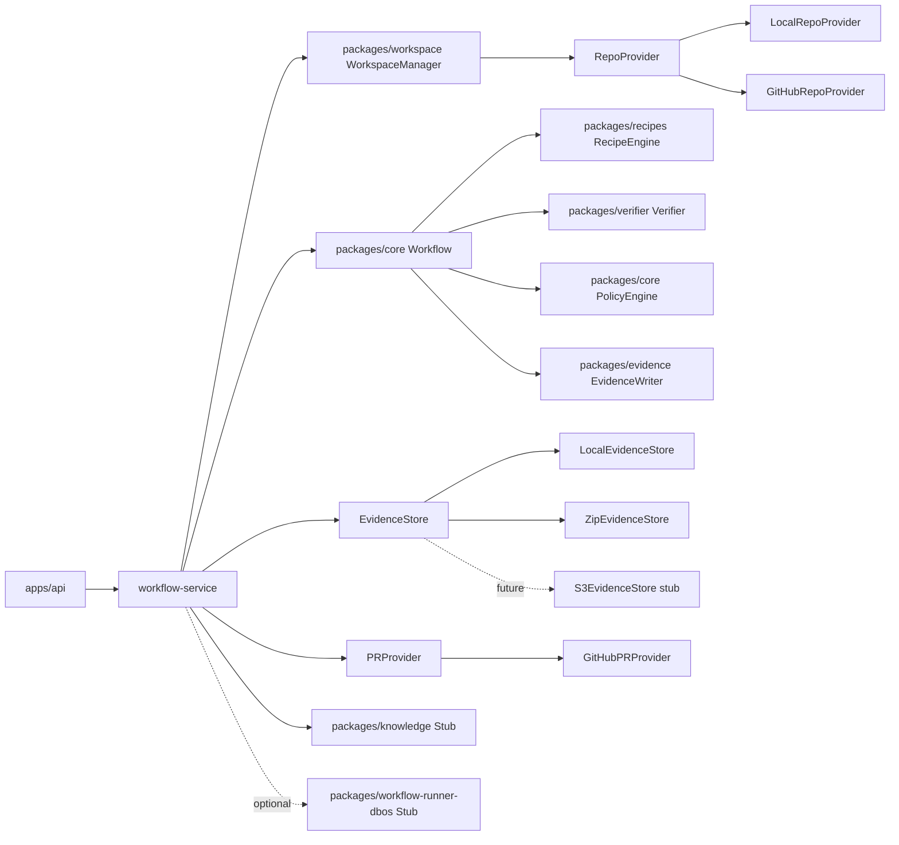
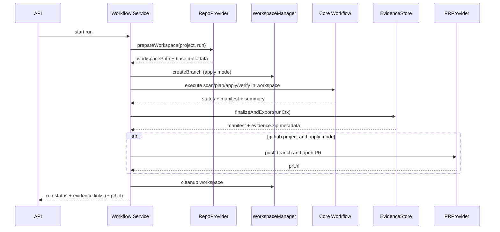

# Code Porter Architecture

## Module Diagram


## V1 Alpha Runtime Flow


## Responsibilities
- `apps/api`: REST endpoints, request validation, DB persistence orchestration, file download route.
- `packages/core`: workflow contracts, stage sequencing, policy checks, scoring, run summary generation.
- `packages/recipes`: deterministic transformations and planning.
- `packages/verifier`: tool detection and command execution for build/test/static checks and failure classification.
- `packages/evidence`: evidence artifact writing, manifest generation, zip export store.
- `packages/workspace`: ephemeral workspace lifecycle, git operations, repo providers, PR provider contracts.
- `packages/workflow-runner-inmemory`: default immediate execution runner.
- `packages/workflow-runner-dbos`: durable orchestration adapter stub.
- `packages/knowledge`: future docs/context publication hook.

## Key Interfaces

### RecipeEngine
```ts
interface RecipeEngine {
  listRecipeIds(): string[];
  plan(scan: ScanResult, files: FileMap): RecipePlanResult;
  apply(scan: ScanResult, files: FileMap): RecipeApplyResult;
}
```

### WorkflowRunner
```ts
interface WorkflowRunner {
  start(runRequest: RunRequest): Promise<{ runId: string }>;
  get(runId: string): Promise<Run>;
}
```

### Verifier
```ts
interface Verifier {
  run(scan: ScanResult, repoPath: string, policy: PolicyConfig): Promise<VerifySummary>;
}
```

### PolicyEngine
```ts
interface PolicyEngine {
  load(path: string): Promise<PolicyConfig>;
  evaluatePlan(input: PlanMetrics, policy: PolicyConfig): PolicyDecision[];
  evaluateVerify(input: VerifySummary, policy: PolicyConfig): PolicyDecision[];
}
```

### WorkspaceManager
```ts
interface WorkspaceManager {
  createWorkspace(input: WorkspaceCreateRequest): Promise<PreparedWorkspace>;
  ensureCleanTree(repoPath: string): Promise<void>;
  checkoutBase(repoPath: string, ref: string): Promise<{ ref: string; commit: string }>;
  createBranch(repoPath: string, campaignId: string, runId: string): Promise<string>;
  cleanupWorkspace(input: WorkspaceCleanupRequest): Promise<void>;
}
```

### RepoProvider
```ts
interface RepoProvider {
  prepareWorkspace(input: RepoPrepareInput): Promise<PreparedWorkspace>;
}
```

### EvidenceStore
```ts
interface EvidenceStore {
  finalizeAndExport(runCtx: RunContext): Promise<{
    manifest: EvidenceManifest;
    zip?: { path: string; sha256: string; size: number };
  }>;
}
```

### PRProvider
```ts
interface PRProvider {
  createPullRequest(input: PullRequestInput): Promise<{ prUrl: string }>;
}
```

## Extension Points

### Legacy Lanes (COBOL, Fortran)
- Add lane-specific scanners behind `ScanStep` extension registry.
- Add lane-specific translators/IR pipelines as separate packages with same workflow contract.
- Reuse evidence, policy, and verifier gates for parity checks.

### Agent Runners
- Deterministic remediator runs after verify only for policy-allowed failure kinds.
- Future agent runner can be inserted after deterministic remediator with constrained action policies.
- Agent outputs must always be policy-gated and evidence-captured before acceptance.
